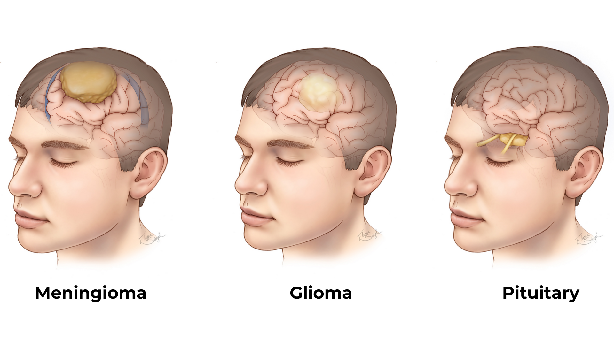
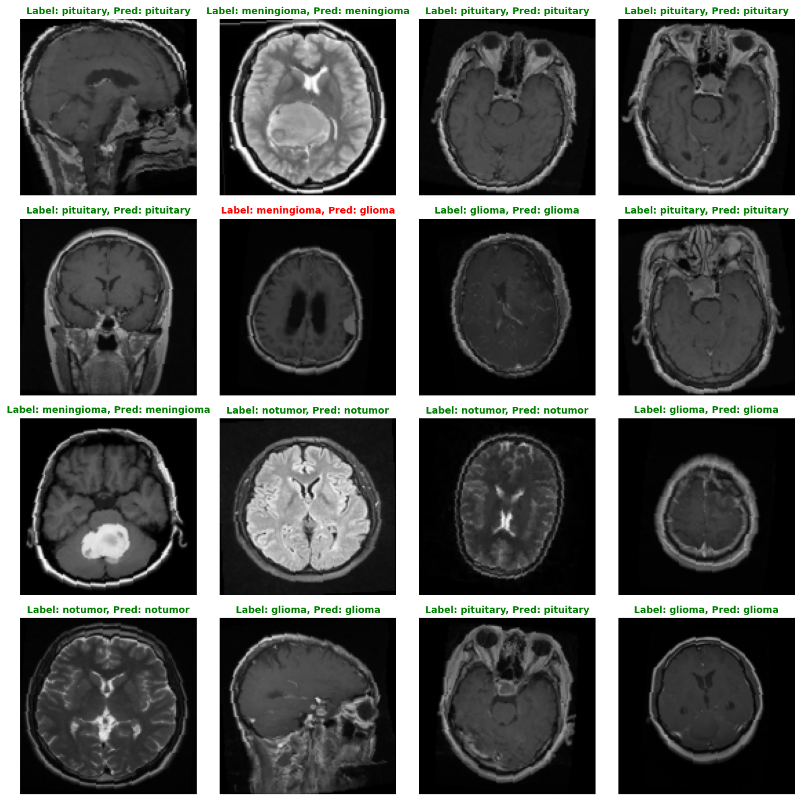

# Brain Tumor Classification

## Description

<div align="center">
    
</div>

Brain tumors are abnormal growths of cells in the brain. They are typically categorized into three types:

1. **Meningiomas**: Tumors that develop in the membranes surrounding the brain and spinal cord.
2. **Gliomas**: Tumors that originate from glial cells, which provide support and insulation to neurons.
3. **Pituitary Tumors**: Growths in the pituitary gland, which regulates hormones in the body.

This project aims to classify brain tumors into these categories using Convolutional Neural Networks (CNNs).

## Dataset
The dataset used for this project is sourced from Kaggle: [Brain Tumor MRI Dataset](https://www.kaggle.com/datasets/masoudnickparvar/brain-tumor-mri-dataset).

## Requirements
To run this project, you will need:

- Python
- Jupyter Notebook
- PyTorch
- Scikit-learn
- Matplotlib
- Seaborn
- Numpy

## How to Run
Follow these steps to run the project:

1. Clone the repository:
   ```bash
   git clone https://github.com/randyver/brain-tumor-classification
   ```
2. Install all required dependencies:
   ```bash
   pip install -r requirements.txt
   ```
3. Run the main script:
   ```bash
   python main.py
   ```
4. To modify training configurations, edit the values in `config.py` as needed.

## Model Architecture
The model is implemented as `TumorClassifierCNN`, consisting of the following layers:

### Convolutional Layers:
```python
(0): Conv2d(3, 32, kernel_size=(3, 3), stride=(1, 1), padding=(1, 1))
(1): ReLU()
(2): MaxPool2d(kernel_size=2, stride=2, padding=0)
(3): Conv2d(32, 64, kernel_size=(3, 3), stride=(1, 1), padding=(1, 1))
(4): ReLU()
(5): MaxPool2d(kernel_size=2, stride=2, padding=0)
(6): Conv2d(64, 128, kernel_size=(3, 3), stride=(1, 1), padding=(1, 1))
(7): ReLU()
(8): MaxPool2d(kernel_size=2, stride=2, padding=0)
```

### Fully Connected Layers:
```python
(0): Linear(in_features=32768, out_features=256, bias=True)
(1): ReLU()
(2): Dropout(p=0.5, inplace=False)
(3): Linear(in_features=256, out_features=4, bias=True)
```

## Evaluation
The model achieves the following performance metrics:

- Accuracy: 93.90%
- Precision: 94.03%
- Recall: 93.90%
- F1-Score: 93.90%

## Sample Result
Below is an example of the model's prediction on a sample image from testing dataset:

<div align="center">
    
</div>